# OpenArm Control & Simulation Platform

[](https://github.com/Manas-arumalla/openarm-control/actions/workflows/ci.yml)


A control, motion-planning, bimanual-coordination, and reinforcement-learning
platform for the **Enactic OpenArm v2** (7-DOF × 2 + grippers) in
[MuJoCo](https://mujoco.org/).

Built on top of the official OpenArm v2 MJCF model, this project adds a clean,
tested `openarm_control/` package (~10.6k LOC, **165 headless tests**) that takes the
arm from raw physics to autonomous behavior: forward/inverse kinematics, Cartesian &
**compliant (admittance)** control, grasping, pick-and-place, color sorting,
RRT-Connect obstacle avoidance, **bimanual** coordination with collision-aware
hand-over, dynamic **catching & throwing**, **articulated-object** manipulation
(drawers/doors/valves), bottle-opening, deformable **cloth folding**, and
**language-commanded** skills — plus a **learned ACT vision policy**, an **RL
insertion suite** (classical vs BC vs RL), and a unified **OpenArm-Bench**.

> Long-term goal: a serious, vision-driven, learning-capable platform —
> culminating in **real-time webcam human-arm imitation**. See
> **[ROADMAP.md](ROADMAP.md)** for the full plan.

> **Related:** [manipdyn](https://github.com/Manas-arumalla/manipdyn) — the single-arm UR5e methods lab where this benchmark approach originated.

<p align="center">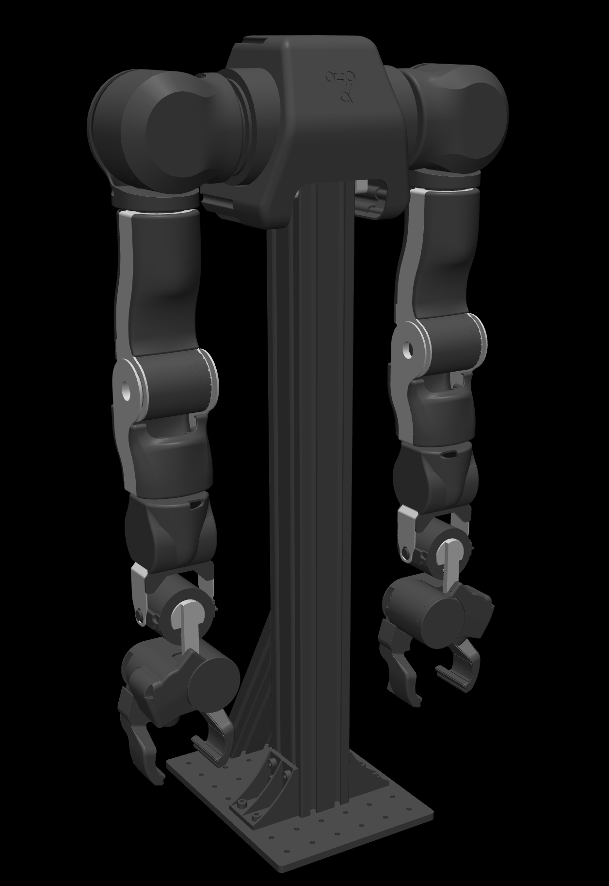</p>

---

## Skills in motion

A few of the manipulation skills, rendered headless from the scripted controllers
(reproduce any of them with `python scripts/gen_showcase_media.py --only <skill>`):

<table>
  <tr>
    <td align="center"><b>Peg-in-hole insertion</b><br>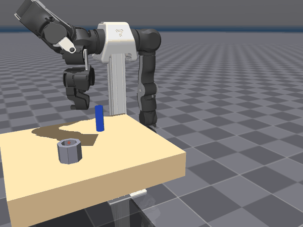</td>
    <td align="center"><b>Open a drawer</b><br>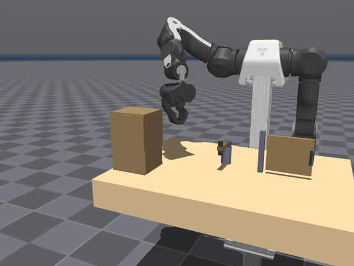</td>
    <td align="center"><b>Fold a cloth</b><br>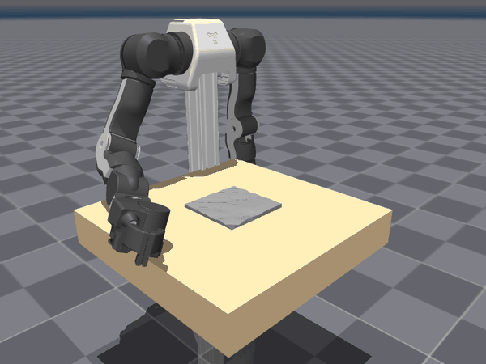</td>
  </tr>
  <tr>
    <td align="center"><b>Unscrew a bottle cap</b><br></td>
    <td align="center"><b>Turn a valve</b><br>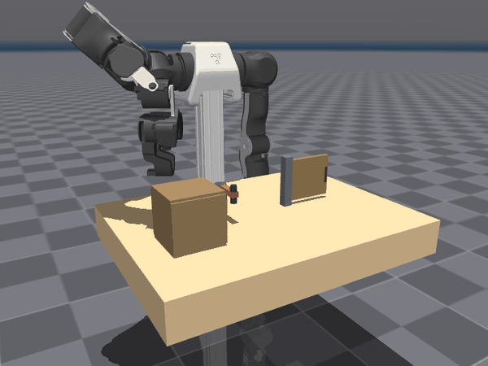</td>
    <td align="center"><b>Compliant press (admittance)</b><br>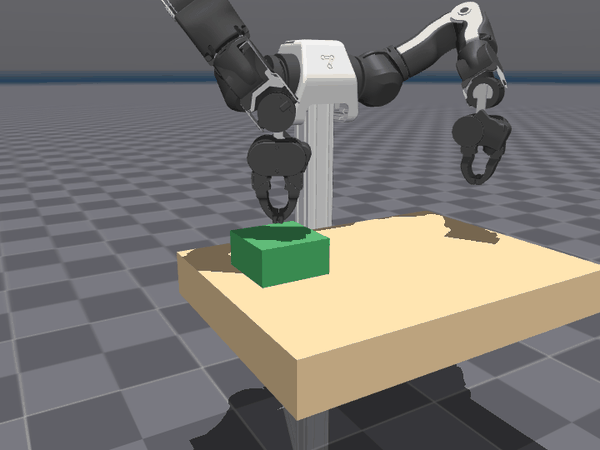</td>
  </tr>
  <tr>
    <td align="center"><b>Ball balance — trajectory</b><br>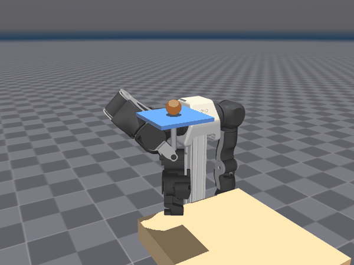</td>
    <td align="center"><b>Ball balance — disturbance rejection</b><br></td>
    <td></td>
  </tr>
</table>

…plus the dynamic flagship — **catching a ball thrown through the air** (Kalman +
MPC interception), shown in [its own section below](#spotlight-catching-a-ball-thrown-through-the-air).

---

## Contents

- [Skills in motion](#skills-in-motion) · [OpenArm-Bench](#openarm-bench--one-protocol-classical-vs-learned)
- [Highlights](#highlights) · [Verified numbers](#verified-numbers) · [Limitations & scope](#limitations--scope)
- [Spotlight: catching a ball](#spotlight-catching-a-ball-thrown-through-the-air) · [Capstone: webcam imitation](#capstone-mimic-a-human-arm--and-hand--from-a-webcam)
- [Catching benchmark](#benchmarks)
- [Install](#install) · [Quickstart](#quickstart) · [Project structure](#project-structure)
- [Documentation](#documentation) · [Credits & license](#credits--license)

---

## OpenArm-Bench — one protocol, classical vs learned

Every manipulation skill is scored by a single benchmark runner with fixed seeds
and per-cell reproduce commands ([full protocol](benchmarks/README.md)). Methods
compared on the same physics: **classical (scripted/model-based) · behaviour
cloning · ACT (vision) · SAC · LQR+SAC residual**.

| Task (protocol) | Classical | BC (state) | ACT (vision+state) | RL |
|---|---|---|---|---|
| **Peg insertion** — success, n=20, randomized socket/offset/friction | **100 %** | 70 % | — | — |
| **Reach** — success, n=20, random targets | — | **95 %** | 80 % | — |
| **Drawer** — opened, frontal grasp (deterministic) | **95 mm** | — | — | — |
| **Door** — swung (deterministic) | **54°** | — | — | — |
| **Valve** — turned (deterministic) | **78°** | — | — | — |
| **Compliant press** — steady contact force (deterministic) | **20 N** (rigid: 64 N) | — | — | — |
| **Cloth fold** — span reduction (deterministic) | **44 %** | — | — | — |
| **Ball balance, static** — settle error (deterministic) | PD 0.44 / LQR 0.39 / **MPC 0.39 mm** | — | — | SAC ✗ off plate · LQR+SAC 5.2 mm |
| **Ball balance, circle** — tracking RMS (deterministic) | PD 40.3 / LQR 39.2 / **MPC 37.7 mm** | — | — | SAC ✗ off plate · LQR+SAC 42.9 mm |

Every number is the output of one command pair (n=20 episodes on the stochastic
tasks; deterministic tasks are seed-invariant single measurements, marked as such):

```bash
python benchmarks/openarm_bench.py           # -> benchmarks/results/openarm_bench.csv
python benchmarks/plot_openarm_bench.py      # -> benchmarks/figures/openarm_bench_*.png
```

| | |
|---|---|
| 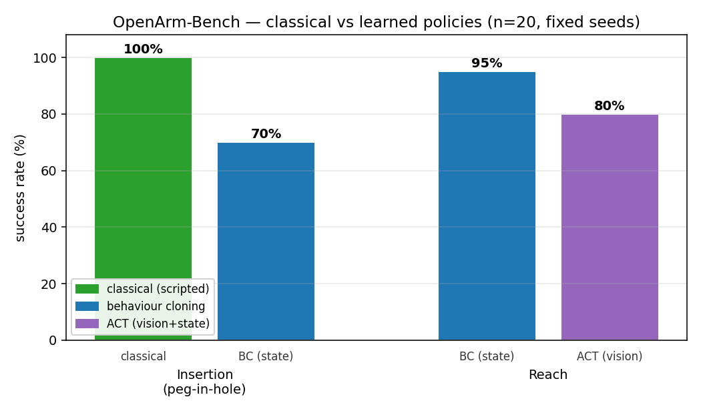 | 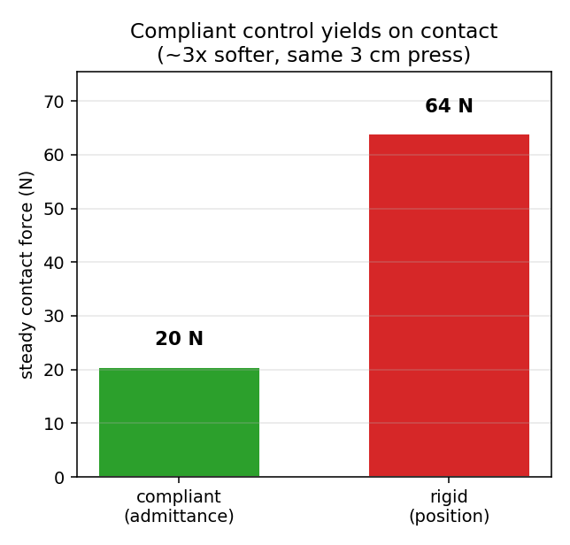 |
| 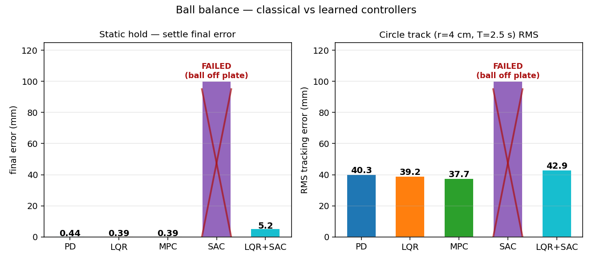 | |

**Reading the balance row.** The ball-on-plate plant is smooth and linear near
equilibrium — the LQR *is* the closed-form optimal feedback — which makes it a
deliberate stress test for model-free RL: SAC from scratch (200 k steps) converges
to a survival strategy and never learns precision; an unregularized SAC residual
on top of LQR *degrades* the 100 %-success baseline to 10 % (the classic
residual-RL bootstrap failure); a squared-action-penalty residual trains cleanly
at 100 % success but cannot beat LQR — there is no modelling gap for a learned
correction to close on clean rigid-body physics. Training curves and analysis in
[`docs/IMPLEMENTATION_LOG.md`](docs/IMPLEMENTATION_LOG.md).

---

## Highlights

| Capability | Module | Demo |
|---|---|---|
| Forward/inverse kinematics (robust LM IK) | `openarm_control/kinematics.py` | `openarm fk` / `openarm ik` |
| Resolved-rate Cartesian control | `openarm_control/controller.py` | `openarm cartesian` |
| Smooth trajectories (quintic) | `openarm_control/trajectory.py` | `openarm trajectory` |
| Top-down grasping + pick-and-place | `openarm_control/grasp.py`, `openarm_control/pick_and_place.py` | `openarm gripper` |
| Autonomous color **sorting** | `openarm_control/autonomy.py` | `openarm sort` |
| **RRT-Connect** obstacle avoidance | `openarm_control/planners/` | `openarm plan` |
| **Bimanual**: parallel sort, mirrored sync, collision-aware hand-off | `openarm_control/bimanual.py` | `openarm bimanual` |
| **Visual servoing**: see, reach & grab a cube (camera-only) | `openarm_control/vision/` | `openarm servo` |
| **Catching** a ball thrown through the air (Kalman ballistic prediction → reachability-aware interception → MPC min-jerk replanning → velocity-matched soft catch); optionally **vision-driven** (two RGB-D cameras), **bimanual** (best-arm selection, collision-free), and **two balls at once** (multi-object tracking, dual catch) | `openarm_control/catching.py`, `openarm_control/vision/ball_tracker.py` | `openarm catch [--vision] [--bimanual] [--twoball]` |
| **Reinforcement learning** (reach + pick-and-place + peg-insertion + ball-balance) | `openarm_control/rl/` | `openarm rl-train --task reach\|pick\|insert\|balance` |
| **Imitation learning** (behavior cloning from scripted demos; **BC vs RL** head-to-head) | `openarm_control/imitation/` | `openarm bc-collect\|bc-train\|bc-eval` |
| **Webcam human-arm imitation** (MediaPipe pose → retargeting → safe real-time teleop; single arm or both) | `openarm_control/teleop/` | `openarm mimic [--webcam] [--bimanual]` |
| **Vision-grounded, language-commanded manipulation** (open-vocab detection → ground → collision-free pick/place; multi-step, queries, undo, clarification) | `openarm_control/agent/`, `openarm_control/vision/` | `openarm manipulate "put the green box in the bin"` |
| **Dynamic throwing** (ballistic inverse + velocity-sized swing + simulation-in-the-loop release search; 5-bin multi-target show) | `openarm_control/throwing.py` | `openarm throw [--multi]` |
| **Stacking & peg-in-hole insertion** (precise point-down descent; a matched peg/hole family — round cylinder/circle, 4-fold square, 180°-symmetric cuboid — with symmetry-aware yaw alignment) | `openarm_control/agent/executor.py` | `openarm stack` / `openarm insert --shape round\|square\|cuboid` |
| **Non-prehensile pushing** (push an object to a goal *without grasping* — closed-gripper pusher, push along the object→target line, re-aim each stroke) | `openarm_control/pushing.py` | `openarm push --goal a\|b` |
| **Tool use / reach extension** (grasp a stick and use its tip to move a block that's *beyond the bare arm's reach* onto a far goal) | `openarm_control/pushing.py` (`ToolController`) | `openarm tool` |
| **Compliant (admittance) control** — yield on contact instead of pushing rigidly (read the end-effector contact force → soften the Cartesian reference); the basis for force-guarded interaction | `openarm_control/contact/` | `openarm admittance` |
| **Articulated-object manipulation** — open a drawer (prismatic), swing a cabinet door (revolute), turn a valve; **language-commanded** ("open the drawer then turn the valve") | `openarm_control/articulated.py`, `openarm_control/agent/articulated_session.py` | `openarm articulated --command "…"` |
| **Bottle opening (unscrew)** — fingertip-pinch a threaded cap and twist it loose on the neck over re-gripping bursts, then lift it off | `openarm_control/bimanual.py` (`UnscrewTask`) | `openarm unscrew` |
| **Learned vision policy — ACT** (Action-Chunking Transformer: CNN image tokens + state → Transformer encoder-decoder → a chunk of future actions; GPU-trained, self-contained) | `openarm_control/imitation/act.py` | `openarm act train\|eval` |
| **RL insertion suite** — domain-randomized peg-in-hole (randomized socket position / start offset / friction / peg radius) with a **classical vs BC vs RL** comparison | `openarm_control/rl/insert_env.py` | `openarm rl-train --task insert` |
| **Deformable cloth folding** — a finer **9×9 self-colliding** MuJoCo flex cloth (settles flat, folds into friction-held layers); grasp a corner and fold the sheet | `openarm_control/cloth.py` | `openarm cloth` |
| **Ball balancing on a plate** — real-time dynamic stabilisation: keep a ping-pong ball centred on a plate the gripper holds, track a circle/figure-8 trajectory, reject random velocity kicks. Three classical controllers — **PD, LQR, MPC** (LQR + trajectory feedforward) — plus two SAC variants (from scratch, and residual on top of LQR) on the same physics, with a five-way head-to-head comparison in OpenArm-Bench. | `openarm_control/balance.py`, `openarm_control/rl/balance_env.py`, `openarm_control/rl/balance_residual_env.py` | `openarm balance [--controller pd\|lqr\|mpc] [--trajectory circle\|figure8] [--perturb]` &nbsp;·&nbsp; `openarm rl-train --task balance\|balance_residual` |
| **Bimanual coordination & hand-over** (nearest-arm pick; hand object across when only the other arm can reach), **driven by natural language** ("grab/move/transfer X to the left/right bin" → best arm + automatic hand-over, with held-state/queries/undo) + interactive object-selection playground (incl. real Google-Scanned meshes) | `openarm_control/bimanual.py`, `openarm_control/agent/bimanual_session.py`, `openarm_control/demos/demo_interactive.py` | `openarm bimanual --mode language\|coordinate` / `openarm interactive [--scanned]` |

All capabilities are covered by **headless tests** (`python -m pytest tests/`).

---

## Verified numbers

Measured in simulation (deterministic, from the test suite / demos):

| Metric | Result |
|---|---|
| IK round-trip accuracy | **0.03 mm** mean position; 0.009 mm / 0.002° on 6-DOF; 100% success |
| Cartesian tracking | **< 0.1 mm** on reachable targets |
| Pick-and-place into a bin | object lands **~6 mm** from the bin centre |
| Stacking (block on block) | **~2 mm** off-centre, aligned and stable |
| Peg-in-hole insertion | round **0 mm**, square **~4 mm**, cuboid **1–2 mm** off-centre, upright, yaw-aligned |
| Dynamic catching (airborne) | clean catches across random throws; ~11 cm mean reach (arm genuinely intercepts) |
| Throwing (narrow 12-cm bins) | lands **5–9 mm** from target across the reachable envelope |
| RL insertion env — classical (scripted) | **100%** inserted across randomized sockets, ~1.5 mm |
| RL insertion env — behaviour cloning (state) | **~70%** (head-to-head vs classical 100%) |
| Reach — BC vs **ACT** (learned, vision + state) | BC **~95%** / ACT **~80%** success |
| Compliant (admittance) contact | **20 N** vs **64 N** for rigid control pressing the same depth (~3× softer) |
| Articulated manipulation | drawer **~95 mm** open (frontal grasp), cabinet door **~54°**, valve **~78°** |
| Cloth fold (single-arm) | folds in half — **~44%** span reduction, lays in self-colliding layers |

---

## Limitations & scope

This is a **simulation** research/engineering platform; what it is *not* yet is stated
plainly so results aren't over-read:

- **Grasping is weld-assisted.** A grasp is held by a MuJoCo equality weld (the gripper
  also closes); this is a standard, reliable sim technique, but it is **not** contact-rich
  force-closure grasping. Numbers above reflect weld-assisted grasps.
- **Perception default is basic.** The dependency-free default detector is a colour/shape
  heuristic; the open-vocabulary model (YOLO-World) is low-confidence on plain sim
  primitives, and a single top-down view is ambiguous. A **hardening pipeline now exists**
  — auto-labeled synthetic data (segmentation + domain randomisation), YOLO fine-tuning,
  and multi-view fusion (`openarm gen-data` / `openarm detect` / `MultiViewPerception`) —
  but the fine-tuned model is **user-run** (GPU), so the out-of-the-box default stays the
  colour/shape detector.
- **Learned policies are modest-scale.** A real **ACT** (action-chunking transformer,
  vision + state, GPU-trained), an **RL insertion env** with a classical-vs-BC-vs-RL
  comparison, and a **learned SAC ball-balancer** (from-scratch and residual-over-LQR
  variants) head-to-head against PD/LQR/MPC on identical physics now exist — but on
  relatively simple tasks (reach, peg-in-hole, ball-on-plate) at small scale, not SOTA,
  and full SAC training is left as a reproducible step (not pre-run in CI).
- **Bimanual works for well-separated tasks.** Two close-mounted 7-DOF arms collide when
  *both* reach over one centred object (their upper arms cross) — so the bottle-unscrew
  and cloth fold are **single-arm**, while well-separated bimanual (hand-over, parallel
  sort) works. A clean two-arm fold/bottle would need a collision-checked dual-arm planner.
- **Insertion uses a forgiving clearance.** A rigid descent jams on a tight hole; tight-
  clearance precision insertion is the compliant-control (admittance) variant.
- **Sim-only.** No real-robot transfer or sim-to-real yet (domain randomisation is used
  inside the insertion env for robustness).
- **Benchmarked, but in simulation.** Catching and throwing have dedicated benchmark
  suites, and **OpenArm-Bench** consolidates the manipulation skills (classical/BC/ACT/RL);
  all numbers are deterministic sim measurements.

---

## Spotlight: catching a ball thrown through the air

<p align="center">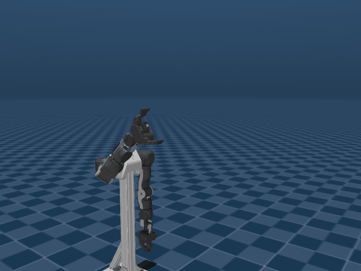</p>

A ball is launched on a ballistic arc from a random point. The arm runs the
textbook robotic catch loop in real time:

1. **Estimate** — a constant-acceleration **Kalman filter** (gravity known) tracks
   the ball and predicts its parabola.
2. **Intercept** — a **reachability- and time-aware solver** finds the earliest
   point on the arc the arm can reach in the available flight time, with the
   gripper oriented to *face the incoming ball*; IK gives the catch configuration.
3. **Replan (MPC)** — every 5 ms it re-fits a **minimum-jerk joint trajectory** to
   arrive at the catch just in time, correcting as the prediction sharpens.
4. **Soft catch** — the hand is **velocity-matched** to the ball, then the fingers
   close at the closest approach for a real grasp.

Verified headless over wide random throws (descent up to ~60°): **160/160 clean
mid-air catches across 4 seeds**, ~11 cm mean reach to the interception (the arm
*moves to meet* the ball — it is not pre-positioned). Reproduce with
`openarm catch --benchmark`.

**The robot does not know where the ball is thrown** — it works the trajectory out
as the ball flies. With `--vision` it observes the ball through **two RGB-D
cameras** (detect → deproject → fuse → Kalman filter) instead of ground-truth
state — fused estimate **~7 mm**, catch rate **9–10/10** (robust to +5 mm sensor
noise). The robot's-eye view (detected ball crosshaired):

<p align="center">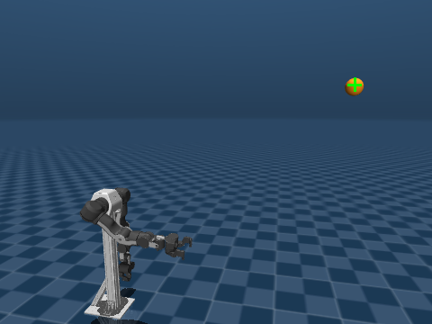</p>

**Bimanual:** with `--bimanual` the ball can be thrown toward *either side*; one
shared estimator solves the interception for both arms, the robot **picks the arm
that reaches best**, and a collision check keeps the arms apart (the idle arm
waits). Verified **18/18** (ground truth) / **12/12** (vision), arm choice matches
the thrown side, **min inter-arm gap ~17–22 cm — zero collisions**.

<p align="center">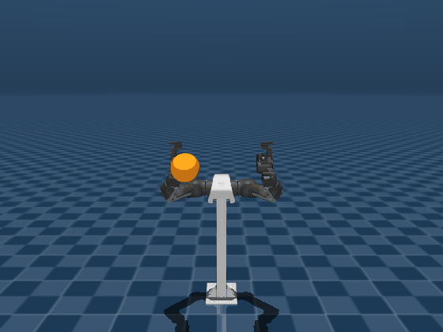</p>

**Two balls at once:** with `--twoball`, two same-colored balls are thrown
simultaneously. **Multi-object tracking** — each camera detects both blobs, points
are fused, and a **per-ball Kalman filter with nearest-neighbor data association**
keeps the two trajectories separate — then each arm catches one *in parallel*,
collision-free. Verified **8/8 both caught** (ground truth & vision), each arm a
distinct ball, no collision.

<p align="center">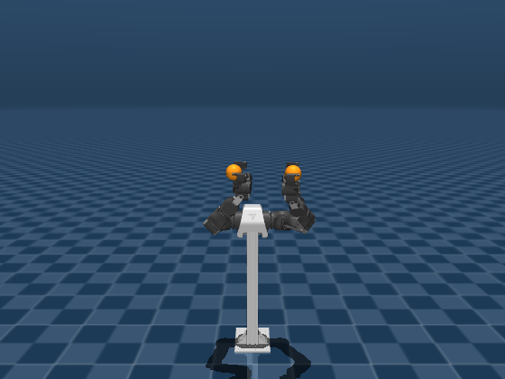</p>

```bash
openarm catch --vision               # catch using only the two cameras
openarm catch --benchmark --vision   # headless vision-driven catch rate
openarm catch --bimanual --vision    # both arms; best-arm selection, collision-free
openarm catch --twoball --vision     # two balls at once; multi-object tracking
openarm catch --twoball --benchmark  # headless two-ball benchmark
```

---

## Capstone: mimic a human arm — and hand — from a webcam

The robot copies your **whole arm and hand** in real time. A webcam frame goes
through **MediaPipe Pose** (shoulder/elbow/wrist) and **MediaPipe Hands** (21 hand
points) each frame. The retargeter is **anatomical and direction-based**: anchored
at your shoulder, it reads your **upper-arm direction** (shoulder→elbow) and
**forearm direction** (elbow→wrist) and drives the robot so *both* segments point
where yours do — the whole arm reproduces your posture, not just the hand, and the
hand position is emergent (it follows your reach at the robot's scale). It also
maps your **hand closure** (open ↔ fist) to the **gripper** — so you can grab.

Because everything is built from **shoulder-relative directions**, it's invariant
to where your body is and to your other arm — moving the other arm doesn't drag
this one (the arms are decoupled). A single **warm-started IK** keeps the joints
temporally coherent (no solution flips), and a teleop layer **smooths,
velocity-limits, and clamps** every command before the motors. The same stack
runs from a synthetic pose source, so it's fully testable without a camera.

```bash
openarm mimic                  # synthetic pose source drives the arm (viewer)
openarm mimic --webcam         # live: your whole arm + hand, via MediaPipe
openarm mimic --webcam --preview  # + a window showing your tracking & the robot mapping
openarm mimic --webcam --pick  # + a table of blocks: close your hand to pick one up
openarm mimic --bimanual       # both arms at once
openarm mimic --headless 4    # headless self-check (tracking error, limits)
```

With `--pick`, closing your hand near a block grabs it (weld-on-grasp), and
opening your hand drops it — reach, grab, move, release, all by mirroring you.

Verified headless (synthetic source, both arms): the robot's **upper-arm and
forearm directions both follow yours** (whole-arm posture), the output is
**unchanged under whole-body translation** (arms decoupled), the gripper follows
your hand (full open↔close travel), **zero IK flips**, peak joint speed safely
limited, joint commands always in range; and a block can be **picked up, lifted
~10 cm, and released**. Live webcam (`--webcam`) needs the `[vision]` extra
(`mediapipe`, `opencv-python`); the pose/hand models auto-download once.

---

## Benchmarks

Reproducible, seeded evaluation of the catcher — tables in
[`benchmarks/results/`](benchmarks/results/), figures in
[`benchmarks/figures/`](benchmarks/figures/) ([details](benchmarks/README.md)):

```bash
python benchmarks/catching_benchmark.py          # CSV tables + figures
```

| | |
|---|---|
| 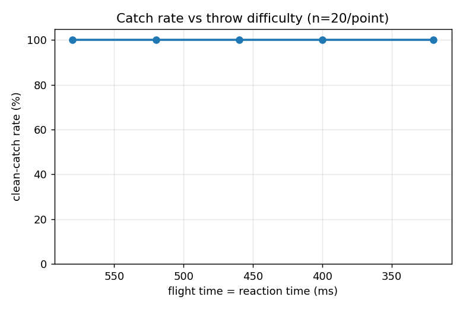 | 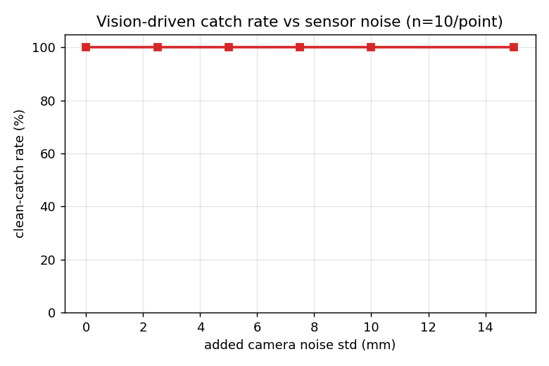 |
| 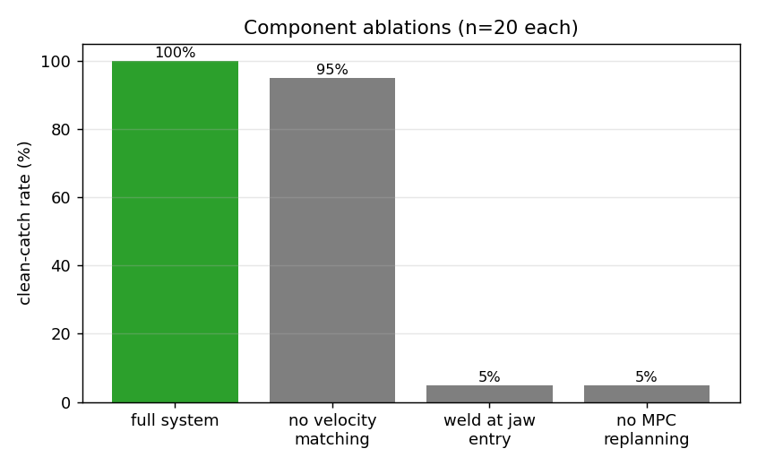 | 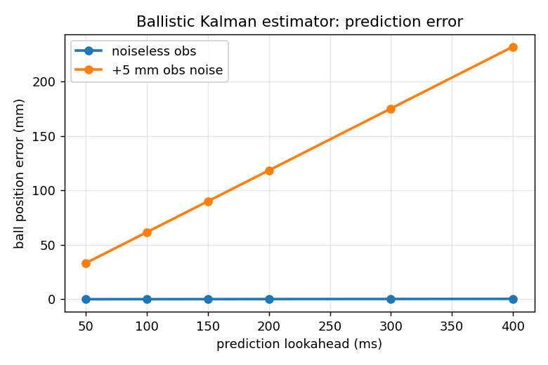 |

Catch rate vs throw difficulty (reaction time) · vs camera noise · component
ablations · and the ballistic estimator's prediction error vs lookahead. The
headline result is the **ablation**: removing MPC replanning collapses the catch
rate from 100 % to 10 %, while removing velocity matching or welding at jaw entry
costs nothing — replanning is the single critical component.

---

## Install

Requires Python ≥ 3.10.

```bash
git clone <this-repo> && cd openarm_mujoco-master
pip install -e .            # core (control, planning, bimanual)
pip install -e ".[rl]"      # + reinforcement learning (gymnasium, stable-baselines3, torch)
pip install -e ".[all]"     # everything (rl, vision, dev tools)
```

---

## Quickstart

After `pip install -e .` everything is available through the **`openarm`** CLI:

```bash
openarm list                       # show all commands
openarm scenes                     # show registered scenes

openarm sort                       # single-arm autonomous color sorting
openarm plan                       # RRT-Connect obstacle avoidance (--planner prm)
openarm bimanual                   # both arms sort simultaneously
openarm bimanual --mode sync       # mirrored synchronized motion
openarm bimanual --mode handoff    # collision-aware right→left hand-off
openarm servo                      # visual servoing: see, reach & grab a cube
openarm catch                      # catch a ball thrown through the air (MPC)
openarm catch --benchmark          # headless catch-rate over random throws
openarm gripper | trajectory | fk | ik | cartesian

openarm rl-train --task reach --timesteps 300000   # train SAC (reach or pick)
openarm rl-eval --task reach                        # watch the trained policy

openarm bc-collect --task reach --episodes 200      # collect scripted demos
openarm bc-train   --task reach --epochs 300        # behavior-clone them
openarm bc-eval    --task reach --compare-rl        # BC vs SAC, same seeds

openarm mimic                      # robot mirrors a synthetic human arm
openarm mimic --webcam             # robot mirrors YOUR arm (MediaPipe webcam)
openarm mimic --bimanual           # both arms at once
openarm mimic --pick               # grab blocks by closing your hand

openarm manipulate "put the green box in the bin"   # vision-grounded, language-commanded
openarm throw                      # ballistic throw into a bin (inverse + swing)
openarm throw --multi              # 5 balls into 5 bins across the workspace
openarm stack "stack the red cube on the green cube"
openarm insert                     # peg-in-hole: cylinder into a circular hole (round)
openarm insert --shape square      # square peg into a rotated square hole (4-fold align)
openarm insert --shape cuboid      # rectangular block into a rotated slot (180-deg align)
openarm push --goal a              # non-prehensile: push a puck onto a goal (no grasp)
openarm tool                       # tool use: grasp a stick, push a block that's beyond bare reach
openarm cloth                      # deformable cloth folding: grasp a corner and fold the sheet over
openarm interactive                # detect objects, pick one by number, dual-arm does it
openarm interactive --scanned      # same, with real Google-Scanned-Object meshes

openarm admittance                 # compliant control: press a soft pad, yield on contact
openarm unscrew                    # bottle opening: unscrew a threaded cap and lift it off
openarm articulated --task drawer  # articulated: open a drawer / door / valve
openarm articulated --command "open the drawer then turn the valve"   # language-commanded
openarm act train --demos demos/reach_vis.npz      # train the ACT vision policy (GPU)
openarm act eval --model demos/reach_act.pt        # evaluate the learned ACT policy
openarm device                     # report the training device (CUDA GPU / VRAM)

openarm gen-data --out datasets/openarm --n 2000    # auto-labeled synthetic detection data (segmentation + DR)
openarm detect train --data datasets/openarm/data.yaml --epochs 80   # fine-tune YOLO on the sim objects
openarm detect eval  --weights runs/openarm/finetune/weights/best.pt --data datasets/openarm/data.yaml

openarm bimanual --mode stack      # both arms build towers simultaneously
openarm bimanual --mode coordinate # nearest-arm pick; hand over when only the other can reach
openarm bimanual --mode language "transfer the red block to the left bin"   # best arm + auto hand-over, by command
openarm bimanual --mode language --interactive   # type bimanual commands live

openarm showcase                   # grand tour: sort→plan→bimanual→servo→catch→stack→insert→mimic
openarm test                       # headless test suite (165 tests)
```

Every command documents its flags in `openarm list`; run `openarm <command> --help`
for full per-flag descriptions.

(Equivalent module form, no install required: `python -m openarm_control.demos.demo_pick_and_place`.)

---

## Project structure

```
openarm_mujoco-master/
├── openarm_control/                     # the control & learning package
│   ├── config.py                # arm specs, gains, grasp/gripper params, scene paths
│   ├── kinematics.py            # FK, tool-point Jacobian, robust LM IK
│   ├── controller.py            # resolved-rate Cartesian controller
│   ├── grasp.py                 # top-down grasp IK (wrist-yaw search)
│   ├── trajectory.py            # quintic joint/Cartesian trajectories
│   ├── gravity_compensation.py  # mass matrix / bias-force utilities
│   ├── pick_and_place.py        # pick-and-place with weld-assisted grasp
│   ├── autonomy.py              # SortingTask state machine
│   ├── bimanual.py              # dual-arm: ParallelSort, sync, RelayHandoff
│   ├── catching.py              # airborne catch: Kalman + interception + MPC
│   ├── contact/                 # compliant admittance control (yield on contact)
│   ├── articulated.py           # open drawer/door, turn valve
│   ├── cloth.py                 # deformable 9x9 self-colliding cloth folding
│   ├── grasp6.py                # 6-DOF grasp solver (beside the top-down one)
│   ├── vision/                  # offscreen camera, color detect, visual servo
│   ├── planners/                # CollisionChecker, RRT-Connect, PRM
│   ├── rl/                      # Gymnasium reach/pick/insert envs + SAC train/eval
│   ├── imitation/               # scripted experts, demo collection, BC + ACT (learned)
│   ├── agent/                   # language parsing + skill sessions
│   ├── teleop/                  # webcam pose -> arm retargeting -> safe teleop
│   └── demos/                   # runnable demos
├── v2/openarm_mujoco_v2/        # OpenArm v2 model + our scenes
│   ├── openarm_v20_bimanual.xml # (upstream model, untouched)
│   ├── single_arm_scene.xml     # sorting scene (3 blocks, 3 bins)
│   ├── single_arm_scene_obstacle.xml
│   ├── bimanual_scene.xml       # wide table, 4 blocks/4 bins, 8 grasp welds
│   ├── reach_scene.xml          # RL reach task
│   ├── vision_scene.xml         # visual-servo cube + top camera
│   ├── catch_scene.xml          # airborne ball catch (+ two RGB-D cameras)
│   ├── catch_bimanual_scene.xml # bimanual catch (both arms + centre cameras)
│   └── teleop_scene.xml         # webcam imitation (both arms, front camera)
├── benchmarks/                  # catching, throwing & OpenArm-Bench suites (+ figures/, results/)
├── scripts/                     # fetch_models.py, gen_showcase_media.py (GIF/PNG renders)
├── demos/                       # trained policies (reach_act.pt, *_bc.pt) — datasets regenerate
├── media/                       # showcase GIFs + screenshots (rendered headless)
├── tests/                       # headless pytest suite (165 tests)
├── docs/IMPLEMENTATION_LOG.md   # detailed build/change history (verified numbers)
├── docs/ROADMAP_EXTENSIONS.md   # the post-v1 extension arc (F1..E1)
├── docs/MODELS.md               # what's versioned vs auto-downloaded vs regenerable
├── docs/archive/                # verbatim originals preserved before publishing polish
└── ROADMAP.md                   # full project roadmap
```

---

## Documentation

- **[ROADMAP.md](ROADMAP.md)** — the complete project plan and phases.
- **[docs/IMPLEMENTATION_LOG.md](docs/IMPLEMENTATION_LOG.md)** — what was built
  and changed, with verified numbers.
- **[docs/ROADMAP_EXTENSIONS.md](docs/ROADMAP_EXTENSIONS.md)** — the post-v1 extension
  arc (6-DOF grasp, admittance, articulated, cloth, ACT, RL insertion, OpenArm-Bench).
- **[docs/MODELS.md](docs/MODELS.md)** — which weights ship, which auto-download, and
  how to regenerate the demo datasets.
- **[benchmarks/README.md](benchmarks/README.md)** — the catching/throwing/OpenArm-Bench
  protocols and how to reproduce every figure.

> Showcase media (the GIFs above) is reproducible: `python scripts/gen_showcase_media.py`.

---

## Credits & license

The underlying **OpenArm v2 MuJoCo model** (`v2/openarm_mujoco_v2/`, meshes,
and the bimanual MJCF) is by **Enactic, Inc.** — see
[docs.openarm.dev](https://docs.openarm.dev/simulation/mujoco),
[Discord](https://discord.gg/FsZaZ4z3We), <openarm@enactic.ai>.

This repository (model + the `openarm_control/` platform) is licensed under the
**Apache License 2.0** — see [`LICENSE`](LICENSE). Participation is governed by
the [Code of Conduct](CODE_OF_CONDUCT.md).

Model © 2025 Enactic, Inc. Control/simulation platform © 2026.
